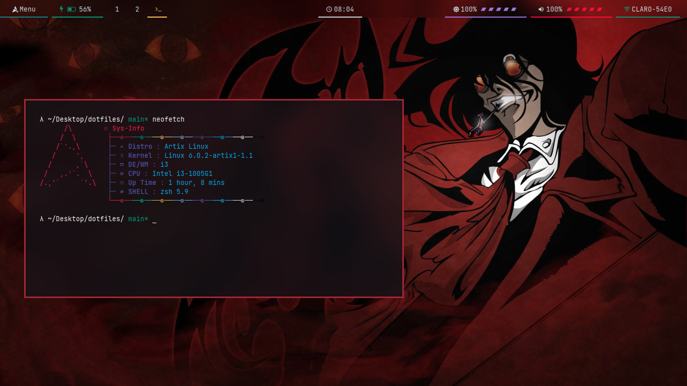

### Yuzu's Dotfiles

| App                       | Name
|---------------------------|-----
| WM/DE                     | i3/i3gaps
| init system               | openrc
| display manager           | gdm
| status bar                | polybar
| menus                     | rofi
| composer                  | picom
| text editor               | vim
| image editor              | inkscape
| file explorer             | nemo
| web browser               | firefox
| terminal emulator         | alacritty
| shell                     | zsh
| keybindings               | sxhkd

related:
- network-manager-applet
- xbacklight
- pulseaudio
- feh
- flameshot

fonts:
- jetbrains mono
- iosevka
- fira code
- truetype

personal notes:
- I'm using a picom fork installed from the AUR `yay -Sy picom-ibhagwan-git`
- I'm using `loginctl suspend` to sleep the PC, I also wrote a keybinding for this
